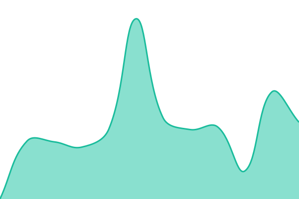

# [📈 Live Status](https://status.mint.lgbt): <!--live status--> **🟧 Partial outage**

This repository contains the open-source uptime monitor and status page for [mint.lgbt](https://mint.lgbt), powered by [Upptime](https://github.com/upptime/upptime).

With [Upptime](https://upptime.js.org), you can get your own unlimited and free uptime monitor and status page, powered entirely by a GitHub repository. We use [Issues](https://github.com/mint-lgbt/status/issues) as incident reports, [Actions](https://github.com/mint-lgbt/status/actions) as uptime monitors, and [Pages](https://status.mint.lgbt) for the status page.

<!--start: status pages-->
<!-- This summary is generated by Upptime (https://github.com/upptime/upptime) -->
<!-- Do not edit this manually, your changes will be overwritten -->
<!-- prettier-ignore -->
| URL | Status | History | Response Time | Uptime |
| --- | ------ | ------- | ------------- | ------ |
|  [Ralsei](ralsei.mint.lgbt) | 🟩 Up | [ralsei.yml](https://github.com/mint-lgbt/status/commits/HEAD/history/ralsei.yml) | 

 132ms
     
 | 

<a href="https://status.mint.lgbt/history/ralsei">94.06%</a>
    

|  [Miko](miko.mint.lgbt) | 🟩 Up | [miko.yml](https://github.com/mint-lgbt/status/commits/HEAD/history/miko.yml) | 

 35ms
     
 | 

<a href="https://status.mint.lgbt/history/miko">100.00%</a>
    

|  [Bunny](bunny.mint.lgbt) | 🟩 Up | [bunny.yml](https://github.com/mint-lgbt/status/commits/HEAD/history/bunny.yml) | 

 119ms
     
 | 

<a href="https://status.mint.lgbt/history/bunny">100.00%</a>
    

|  [Matrix](https://matrix.mint.lgbt:8448/_matrix/federation/v1/version) | 🟩 Up | [matrix.yml](https://github.com/mint-lgbt/status/commits/HEAD/history/matrix.yml) | 

 1230ms
     
 | 

<a href="https://status.mint.lgbt/history/matrix">87.21%</a>
    

|  [XMPP](https://xmpp.mint.lgbt) | 🟩 Up | [xmpp.yml](https://github.com/mint-lgbt/status/commits/HEAD/history/xmpp.yml) | 

 1391ms
     
 | 

<a href="https://status.mint.lgbt/history/xmpp">94.16%</a>
    

|  [Femgit](https://fem.mint.lgbt/api/v1/version) | 🟥 Down | [femgit.yml](https://github.com/mint-lgbt/status/commits/HEAD/history/femgit.yml) | 

 181ms
     
 | 

<a href="https://status.mint.lgbt/history/femgit">0.00%</a>
    

|  [Chibisafe](https://chibi.mint.lgbt/api/health) | 🟥 Down | [chibisafe.yml](https://github.com/mint-lgbt/status/commits/HEAD/history/chibisafe.yml) | 

 166ms
     
 | 

<a href="https://status.mint.lgbt/history/chibisafe">0.00%</a>
    

|  [Miniflux](https://rss.mint.lgbt) | 🟥 Down | [miniflux.yml](https://github.com/mint-lgbt/status/commits/HEAD/history/miniflux.yml) | 

 786ms
     
 | 

<a href="https://status.mint.lgbt/history/miniflux">100.00%</a>
    

|  [CloudTube](https://tube.mint.lgbt) | 🟩 Up | [cloud-tube.yml](https://github.com/mint-lgbt/status/commits/HEAD/history/cloud-tube.yml) | 

 1046ms
     
 | 

<a href="https://status.mint.lgbt/history/cloud-tube">94.25%</a>
    

|  [Redlib](https://redlib.mint.lgbt) | 🟩 Up | [redlib.yml](https://github.com/mint-lgbt/status/commits/HEAD/history/redlib.yml) | 

 1082ms
     
 | 

<a href="https://status.mint.lgbt/history/redlib">94.30%</a>
    

|  [4get](https://search.mint.lgbt/ami4get) | 🟥 Down | [4get.yml](https://github.com/mint-lgbt/status/commits/HEAD/history/4get.yml) | 

 637ms
     
 | 

<a href="https://status.mint.lgbt/history/4get">0.00%</a>
    

|  [Shoelace](https://shoelace.mint.lgbt) | 🟩 Up | [shoelace.yml](https://github.com/mint-lgbt/status/commits/HEAD/history/shoelace.yml) | 

 997ms
     
 | 

<a href="https://status.mint.lgbt/history/shoelace">94.39%</a>
    

|  [BreezeWiki](https://breeze.mint.lgbt) | 🟩 Up | [breeze-wiki.yml](https://github.com/mint-lgbt/status/commits/HEAD/history/breeze-wiki.yml) | 

 1024ms
     
 | 

<a href="https://status.mint.lgbt/history/breeze-wiki">94.44%</a>
    

<!--end: status pages-->

[**Visit our status website →**](https://status.mint.lgbt)

## 📄 License

- Powered by: [Upptime](https://github.com/upptime/upptime)
- Code: [MIT](./LICENSE) © [mint.lgbt](https://mint.lgbt)
- Data in the `./history` directory: [Open Database License](https://opendatacommons.org/licenses/odbl/1-0/)
